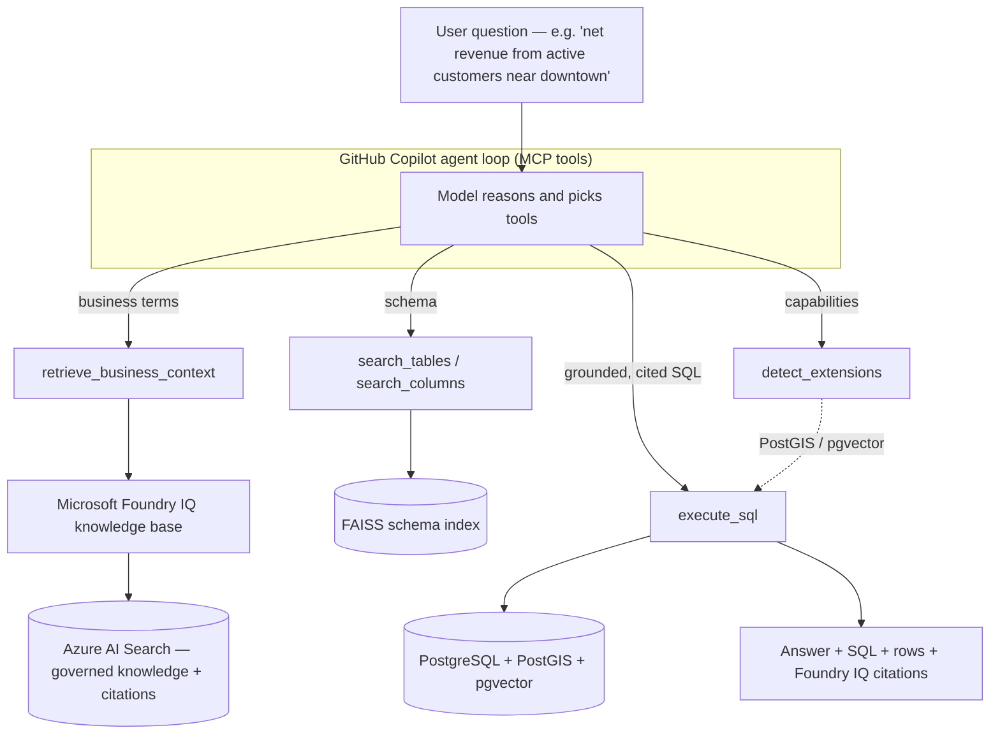

# SQL Query Assistant

**Natural-language SQL powered by GitHub Copilot Chat + Model Context Protocol (MCP)**

Ask questions about any relational database in plain English. A GitHub Copilot
Chat model drives a set of **MCP tools** that explore the schema, build and
validate SQL, and execute it safely — then explains the results.

> **🏆 Agents League entry — grounded by Microsoft Foundry IQ.** Beyond raw
> text-to-SQL, the agent first grounds business terms in a **Foundry IQ**
> governed knowledge base (Azure AI Search) so every query uses *approved*
> metric definitions and **cites its sources** — and it adapts to the database's
> installed extensions (PostGIS spatial, pgvector semantic search).
> See **[Microsoft Foundry IQ — Governed Knowledge Grounding](#microsoft-foundry-iq--governed-knowledge-grounding)**.

## Demo Video

[Watch the 4-minute QueryBench hackathon demo](./querybench_hackathon_PPT.mp4)

This walkthrough shows the agent experience end to end: governed business
context from Microsoft Foundry IQ, MCP tool calls, PostGIS/pgvector-aware SQL,
validation, execution, and the trust panel that explains why the answer can be
trusted.

---

## How It Works

Instead of asking a model to blurt out SQL in one shot, this project runs an
**agent loop**: the Copilot model is given a toolbox (MCP tools) and decides,
step by step, how to discover the schema, assemble a query, validate it, and
run it.

```
┌──────────────────────────────────────────────────────────────────┐
│                      Angular Frontend (UI)                         │
│   ┌────────────┐ ┌────────────┐ ┌────────────┐ ┌────────────┐      │
│   │  Copilot   │ │   Schema   │ │ Dashboard  │ │    Data    │      │
│   │    Chat    │ │  Explorer  │ │  (Logs)    │ │  Analytics │      │
│   └────────────┘ └────────────┘ └────────────┘ └────────────┘      │
│                        HTTP REST API                               │
└───────────────────────────────┬────────────────────────────────────┘
                                 │
┌───────────────────────────────▼────────────────────────────────────┐
│                       FastAPI Backend (Python)                       │
│                                                                      │
│   ┌──────────────── GitHub Copilot Agent Loop ──────────────────┐   │
│   │  user question                                               │   │
│   │      │                                                       │   │
│   │      ▼   model picks tools ──►  MCP tool calls  ──┐          │   │
│   │   reason ◄──────────── tool results ◄─────────────┘          │   │
│   │      │   (repeat until the answer is ready)                  │   │
│   │      ▼                                                       │   │
│   │   final answer + SQL + rows                                  │   │
│   └──────────────────────────────────────────────────────────────┘   │
│                                                                      │
│   ┌──────────────┐  ┌──────────────┐  ┌───────────────────────────┐ │
│   │  MCP Server  │  │ Schema Index │  │  Connection / Query Mgmt  │ │
│   │  (MCP tools) │  │  (optional   │  │  (SQLAlchemy pools)       │ │
│   │              │  │   FAISS RAG) │  │                           │ │
│   └──────────────┘  └──────────────┘  └───────────────────────────┘ │
└───────────────────────────────┬────────────────────────────────────┘
                                 │
┌───────────────────────────────▼────────────────────────────────────┐
│      Your Database  ·  PostgreSQL / MySQL / SQL Server / Oracle      │
└──────────────────────────────────────────────────────────────────────┘
```

The same MCP tool surface is also exposed over **stdio** and (optionally) **HTTP**,
so IDE clients like VS Code, Cursor, or Claude Desktop can use it directly.

---

## Microsoft Foundry IQ — Governed Knowledge Grounding

Text-to-SQL is everywhere; the hard part is making it **trustworthy for
enterprises**. This project integrates **[Microsoft Foundry IQ](https://aka.ms/iq-series)**
— Microsoft's managed, permission-aware knowledge layer over enterprise data —
as the grounding step *before* SQL is written.

- **Structured half:** a local **FAISS** index answers *which table/column*.
- **Unstructured half:** **Foundry IQ** (Azure AI Search) answers *what a
  business term actually means* — data-dictionary entries, metric definitions,
  glossary terms, and PostGIS/pgvector conventions — and returns **citations**.

The agent fuses both: it grounds ambiguous terms (e.g. *"active customer"*,
*"net revenue"*, *"downtown"*) in their **approved** definitions, then writes SQL
that matches — and tells you which governed source it used. That is the
*"beyond traditional RAG"* enterprise-intelligence story Foundry IQ is built for.



**Why it matters:** ask a question with an ambiguous business term and the agent
retrieves the **governed definition from Foundry IQ, cites it, and generates SQL
that matches** — where a naive agent would guess and get it subtly wrong.

**Graceful by design:** Foundry IQ is optional. Without Azure credentials the
`retrieve_business_context` tool returns `configured: false` and the agent
continues with the schema tools — the app runs identically either way.

---

## MCP Tools

The agent has access to tools across a few categories:

| Category | Tools |
|----------|-------|
| **Knowledge grounding** | `retrieve_business_context` (Microsoft Foundry IQ) |
| **Discovery** | `search_tables`, `search_columns`, `introspect_schema`, `preview_data`, `sample_column_values` |
| **Relationships** | `check_relationships`, `discover_join_paths` |
| **Advanced SQL** | `detect_extensions`, `semantic_data_search` (pgvector) |
| **SQL lifecycle** | `generate_sql`, `validate_sql`, `execute_sql`, `explain_sql`, `fix_sql` |
| **Connection** | `connect_database`, `switch_database`, `get_connection_profile`, `analyze_connection_performance`, `validate_server_compatibility`, `check_db_integrity` |

All execution is **SELECT-only** and passes through a SQL validator (injection
detection, keyword blocking, single-statement enforcement) before it runs.

---

## Quick Start

### Prerequisites
- **Python 3.10+** (3.13 supported)
- **Node.js 18+** and npm (Angular 17 requires ≥ 18)
- A reachable **SQL database** (PostgreSQL, MySQL, SQL Server, or Oracle)
- A **GitHub account with Copilot access** (authenticated at runtime via device code)

### Backend Setup
```bash
cd server

# Create and activate virtual environment
python -m venv venv
.\venv\Scripts\Activate.ps1   # Windows PowerShell
source venv/bin/activate      # Linux/Mac

# Install dependencies
pip install -r requirements.txt

# Configure environment
cp .env.example .env
# Edit .env — generate a SECRET_KEY:
#   python -c "import secrets; print(secrets.token_urlsafe(48))"

# Start server
python main.py
```
Backend: `http://localhost:8090` · API docs: `http://localhost:8090/api/docs`

### Frontend Setup
```bash
cd ui
npm install
npm start
```
Frontend: `http://localhost:4280`

> Override ports via `PORT=` in `server/.env` and the `--port` flag in the
> `start` script of `ui/package.json`.

### Usage
1. Open `http://localhost:4280`.
2. Go to **Settings → Database Connections** and connect to your database.
3. Open **Copilot Chat**, sign in to GitHub Copilot (device-code prompt), and
   ask questions in natural language.
4. Use **Schema Explorer**, **Dashboard**, and **Analytics** to browse the
   schema and review query history.

---

## Microsoft Foundry IQ — Setup (optional but recommended)

Grounding is **optional**: without it the agent runs exactly as before. With it,
the agent grounds business terms in governed knowledge and cites sources.

1. **Provision Azure resources** with the Microsoft IQ Series template
   (Azure AI Search + Azure OpenAI + a Foundry project):
   <https://aka.ms/iq-series/deploytoazure>
2. **Configure** `server/.env` (secrets come from the environment — never commit them):
   ```bash
   AZURE_SEARCH_ENDPOINT=https://<service>.search.windows.net
   AZURE_SEARCH_API_KEY=<admin-key>
   FOUNDRY_SEARCH_INDEX=querybench-knowledge
   # Optional — enables Foundry IQ knowledge-base agentic retrieval:
   FOUNDRY_KNOWLEDGE_BASE_NAME=<your-knowledge-base>
   ```
3. **Ingest the governed knowledge** (business glossary + spatial/vector
   conventions in `server/data/foundry_knowledge/knowledge.json`):
   ```bash
   cd server
   python scripts/ingest_knowledge.py
   ```

When configured, `retrieve_business_context` answers from your knowledge base;
when not, it returns `configured: false` and the agent proceeds schema-only.

## Demo database (PostGIS + pgvector)

A ready-to-run demo database showcases the spatial + semantic features. It seeds
a sizeable geospatial retail dataset — **100 stores, 5,000 customers, 30,000
orders, 24 products** (all SRID 4326) — that pairs with the governed Foundry IQ
knowledge.

**Option A — Docker (self-contained):**

```bash
cd demo
$env:POSTGRES_PASSWORD = "<choose-a-strong-password>"   # PowerShell
docker compose up --build -d
# populate product embeddings for pgvector semantic search:
$env:DEMO_DB_PASSWORD = $env:POSTGRES_PASSWORD
python seed_embeddings.py
```

Connect Query Bench to `localhost:5433` / `querybench_demo` / `querybench`.

**Option B — No Docker (hosted or local PostgreSQL):** run the single combined
script [`demo/setup_hosted.sql`](demo/setup_hosted.sql) on any PostgreSQL that
has **PostGIS** and **pgvector** available:

- **Hosted (fastest):** create a free **Supabase** project (PostGIS + pgvector
  preinstalled) or an **Azure Database for PostgreSQL Flexible Server** (enable
  `POSTGIS` and `VECTOR` in the `azure.extensions` allow-list), then paste/run
  the script in its SQL editor:
  ```bash
  psql "<connection-string>" -f demo/setup_hosted.sql
  ```
- **Local PostgreSQL:** install PostGIS (via StackBuilder) and pgvector, then
  run the same script.

Then populate embeddings (set `DEMO_DB_HOST/PORT/NAME/USER/PASSWORD` to your DB):

```bash
python demo/seed_embeddings.py
```

> **No PostGIS/pgvector available?** The app still works — `detect_extensions`
> reports them absent and the agent falls back to standard ANSI SQL. The map
> view also renders plain `latitude`/`longitude` columns, so spatial results
> still plot even without PostGIS.

Once connected, try the grounded demos:

- *"What is our net revenue from active customers?"* → grounds **"active
  customer"** and **"net revenue"** in Foundry IQ, then writes SQL matching the
  governed definition (completed orders, last 90 days, amount − discount − refund).
- *"Which stores are within 5 km of downtown?"* → grounds the **downtown**
  reference point + spatial conventions, then emits correct
  `ST_DWithin(geom::geography, …)` PostGIS SQL.
- *"Find products similar to 'warm clothing for winter'"* → uses
  `semantic_data_search` over the pgvector `embedding` column.

---

## Features

- Natural-language → SQL via a GitHub Copilot Chat **agent loop** over MCP tools
- **Microsoft Foundry IQ grounding** — governed business definitions with
  **citations**, so SQL is explainable and auditable (graceful when unconfigured)
- **Extension-aware** — detects PostGIS / pgvector and adapts the SQL it writes
- **PostGIS spatial** queries (distance / "near" / containment) grounded by
  governed spatial conventions
- **pgvector semantic search** over embedding columns (`semantic_data_search`)
- Works with **any** connected database through live schema introspection
- Optional FAISS semantic search over schema (drop in `data/schema_hints.json`)
- **Schema Explorer** — browse tables, columns, keys, and relationships
- **Dashboard** — query/execution logs, token usage, and cost analytics
- **Data Analytics** — visualizations and column statistics
- SELECT-only execution with SQL validation and safety checks
- MCP server exposed over **stdio** and optional **HTTP** for IDE clients
- Multi-database support: PostgreSQL, MySQL, SQL Server, Oracle

---

## Project Structure

```
sql-query-assistant/
├── server/                     # Python FastAPI backend
│   ├── main.py                 # Application entry point
│   ├── mcp_stdio_server.py     # MCP server for IDE integration (stdio)
│   ├── requirements.txt        # Python dependencies
│   ├── app/
│   │   ├── config/             # Settings and rate limits
│   │   ├── exceptions/         # Error handling
│   │   ├── middleware/         # Auth + security headers
│   │   ├── models/             # Request/response Pydantic schemas
│   │   ├── routes/             # API endpoints (database, copilot, mcp, monitoring)
│   │   ├── services/           # Core logic (database, copilot agent, Foundry IQ, logging)
│   │   └── mcp_server/         # MCP server + tools (incl. retrieve_business_context)
│   ├── scripts/                # ingest_knowledge.py — Foundry IQ knowledge ingest
│   └── data/                   # Runtime stores + data/foundry_knowledge/ governed knowledge
├── demo/                       # Demo DB: PostGIS + pgvector (docker compose + seed)
├── ui/                         # Angular 17 frontend
│   └── src/app/
│       ├── components/
│       │   ├── mcp-agent/          # Copilot Chat interface
│       │   ├── connection-dialog/  # Database connection
│       │   ├── dashboard/          # Logs & cost dashboard
│       │   ├── data-analytics/     # Data visualization & stats
│       │   ├── schema-explorer/    # Database schema browser
│       │   ├── sidebar/            # Navigation
│       │   └── shared/             # Shared components
│       ├── models/             # TypeScript interfaces
│       └── services/           # API, MCP-agent, theme, state services
└── README.md                   # This file
```

## Documentation

- **[server/README.md](server/README.md)** — Backend API, endpoints, configuration
- **[ui/README.md](ui/README.md)** — Frontend setup and components

## MCP Integration

Expose the MCP server to an IDE client over stdio:

```json
{
  "servers": {
    "sql-query-assistant": {
      "command": "python",
      "args": ["server/mcp_stdio_server.py"],
      "type": "stdio"
    }
  }
}
```

Or enable HTTP transport with `MCP_HTTP_ENABLED=true` in `server/.env` and
connect to `http://localhost:8090/mcp`.

---

## Tech Stack

- **Backend**: FastAPI, SQLAlchemy, MCP Python SDK, (optional) FAISS + sentence-transformers
- **Frontend**: Angular 17, Angular Material, Tailwind CSS
- **AI**: GitHub Copilot Chat models via the Copilot API (agent LLM)
- **Microsoft IQ**: Foundry IQ knowledge grounding via Azure AI Search (`azure-search-documents`)
- **Databases**: PostgreSQL (incl. PostGIS + pgvector), MySQL, SQL Server, Oracle
